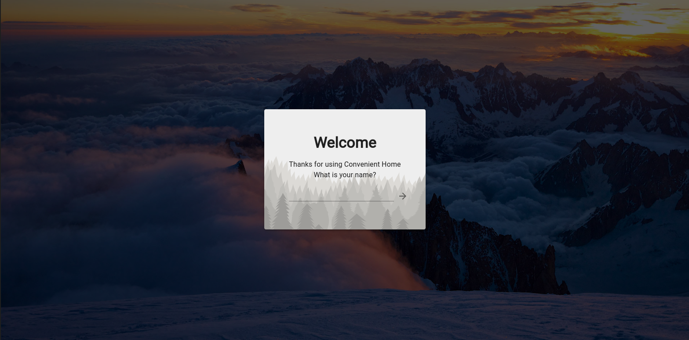
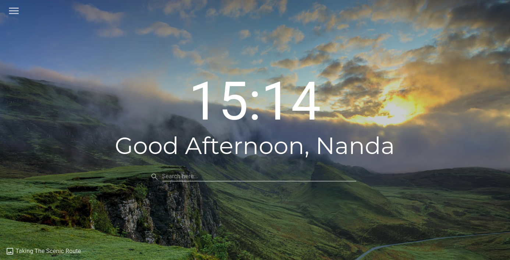
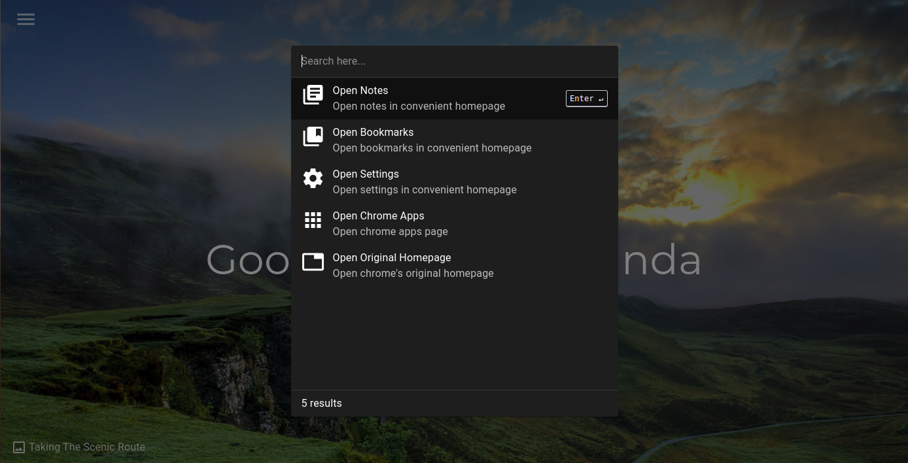
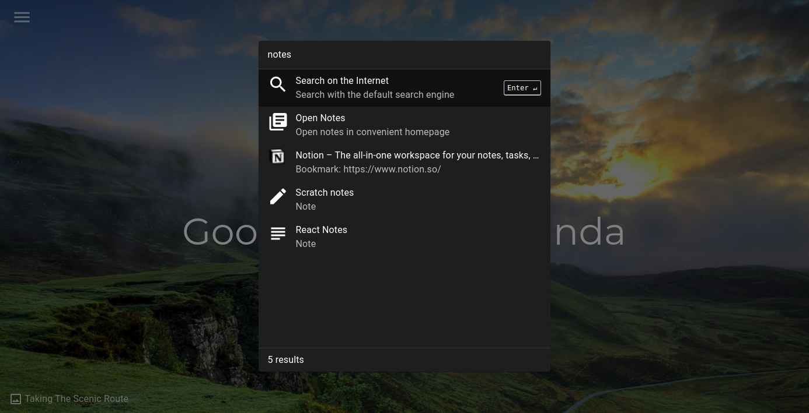
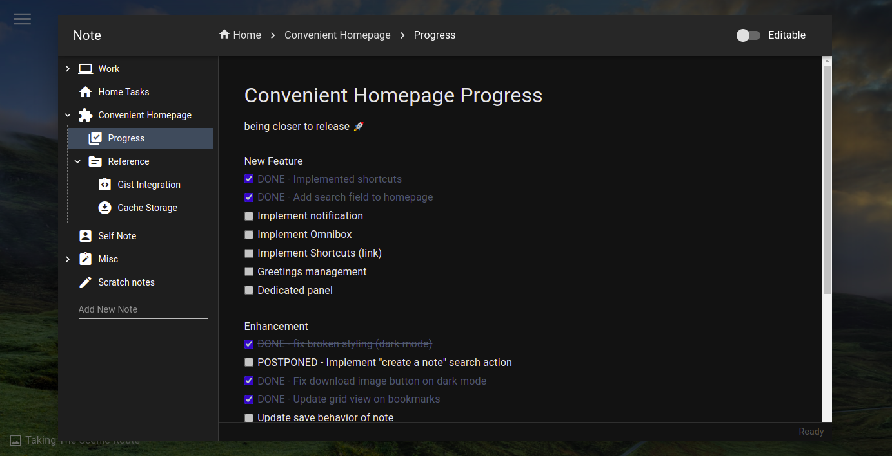
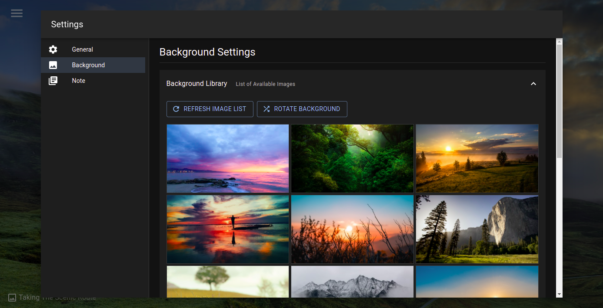
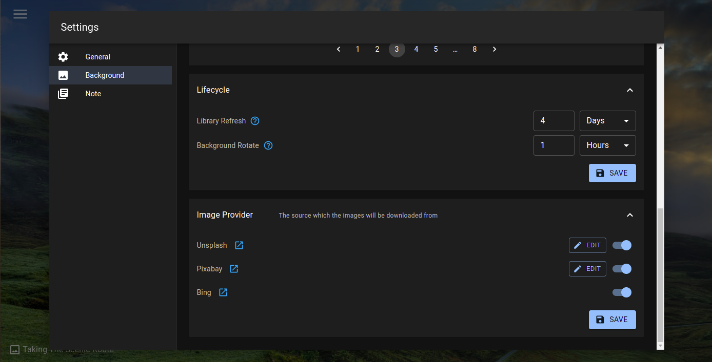
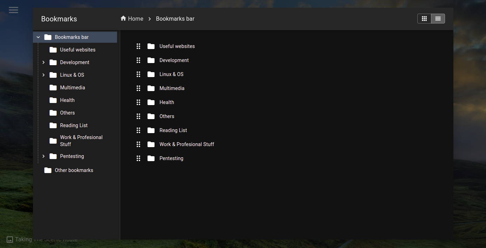
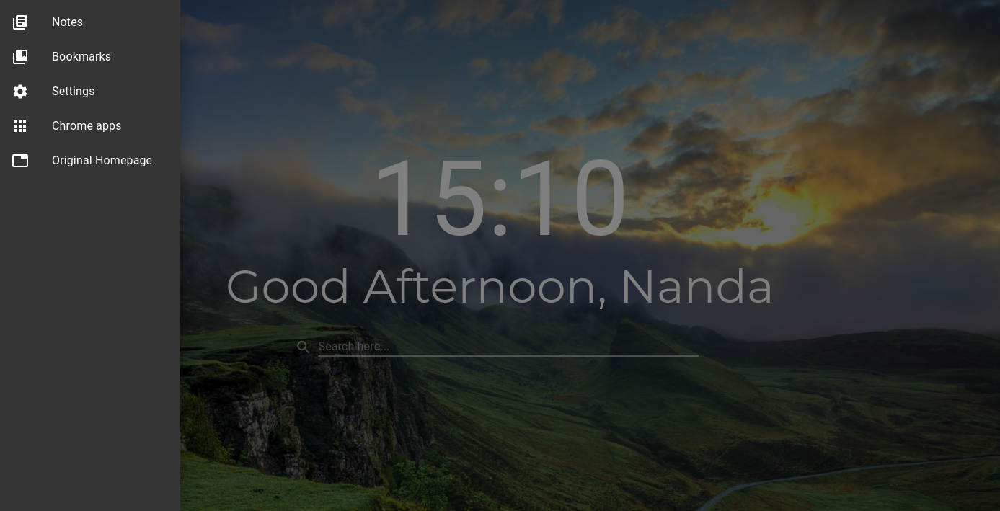

# Convenient Homepage

>a chrome extension served as a homepage with built-in notes, links manager and global search

# Features
- **Background rotation** - configurable background rotation, utilize images from bing, unsplash, pixabay
- **Notes** - create and save markdown like notes locally in you browser
- **Bookmarks** - enumerate all your bookmarks and manage them here
- **Global search panel** - search everything in one place
- **Restorable Database** - backup and restore your data as json

# Installation

1. clone this repository `git clone https://github.com/nafalabi/convenient-homepage.git`
2. install dependencies `yarn install` make sure you have node v16
3. fill in .env variables (sample is in .env.sample)
4. build the app `yarn build`
5. go to chrome extension manager and turn on developer mode
6. click on `load unpacked` and choose `<convenient_homepage_folder>/build`

# Showcase

### Initial install

### Homepage

### Global Search (notes, bookmarks, links)

### Global Search - searching keyword

### Notes

### Settings

### Settings 2

### Bookmarks

### Menu

